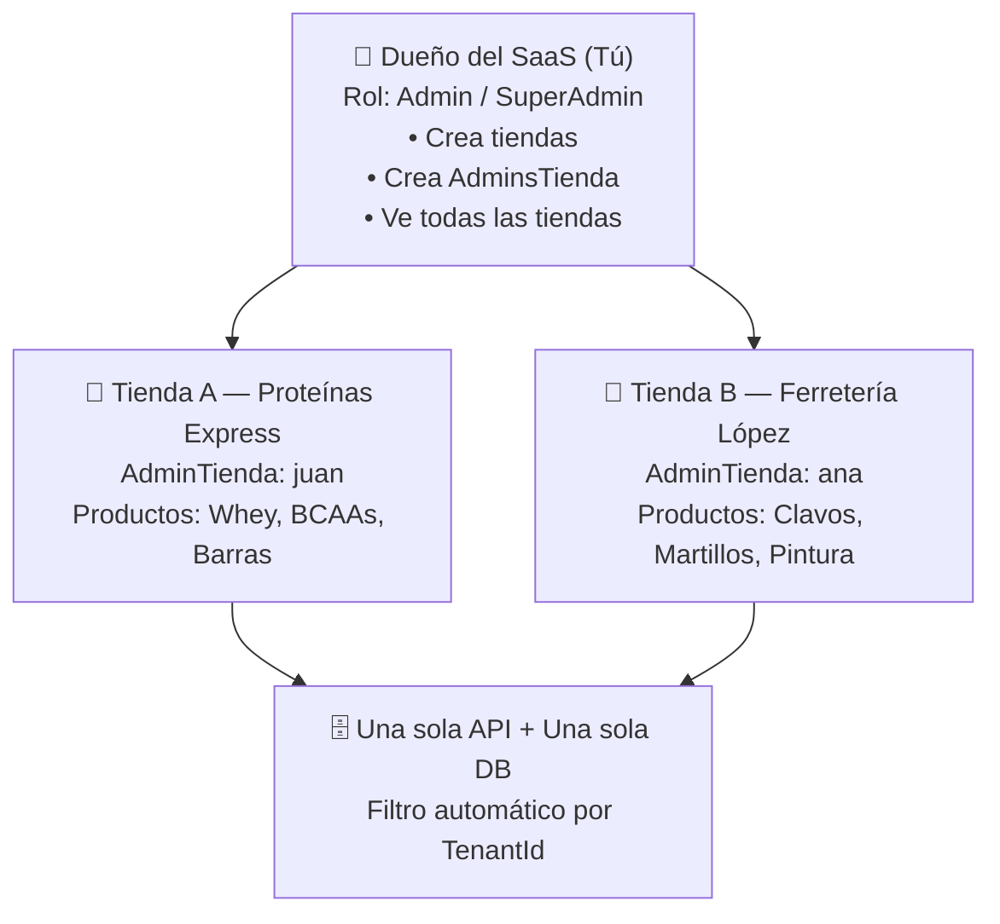
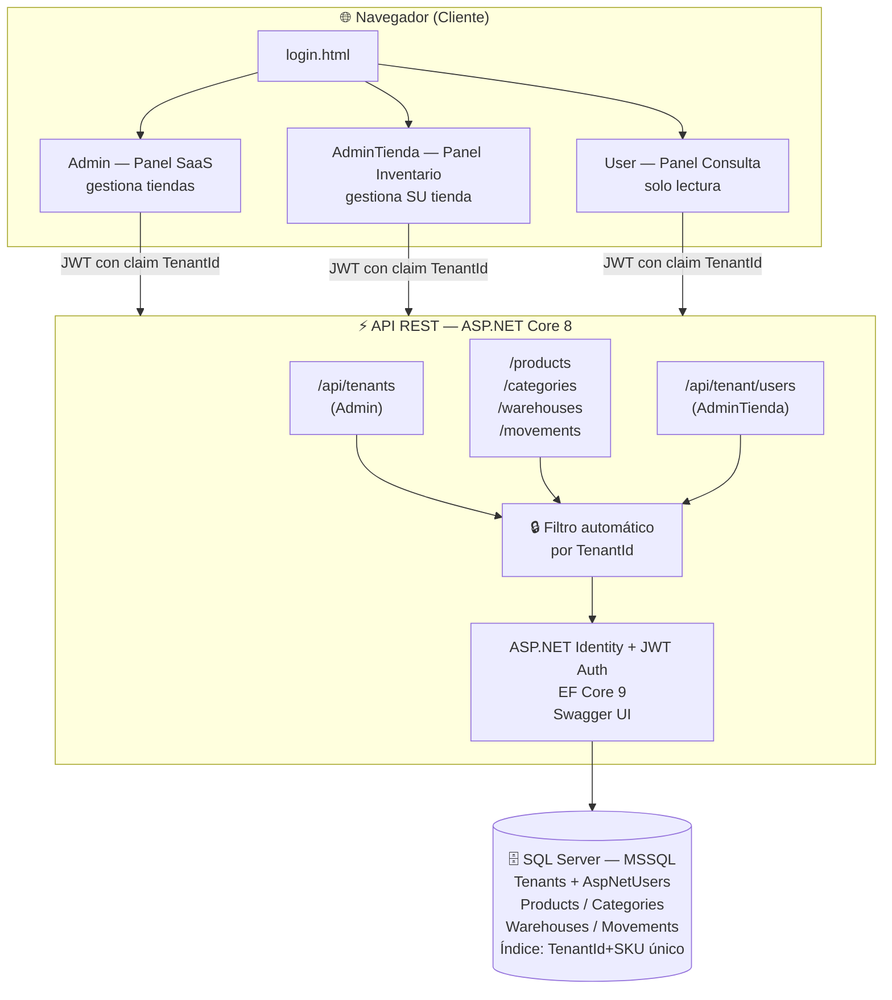
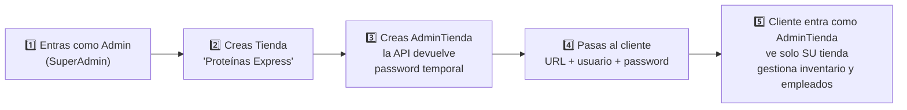
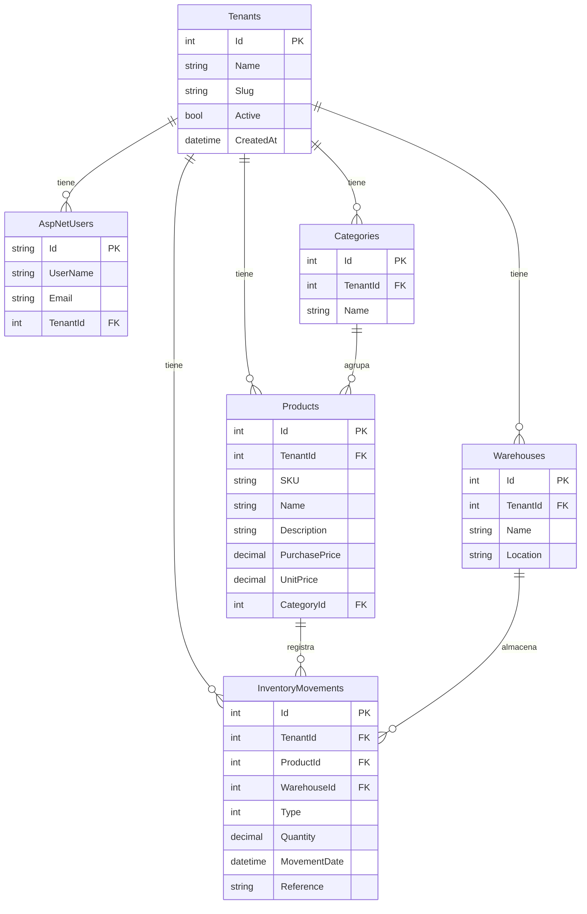

# 🌐 Shelf — Sistema de Inventario Multi-Tienda

Sistema de inventario web **multi-tenant** (SaaS) pensado para rentarse a múltiples tiendas (suplementos, ferreterías, colmados, etc.). Cada tienda cliente opera su propio inventario de forma aislada, sin que sus datos se mezclen con los de otras tiendas.

---

## 🎯 ¿Qué es multi-tenancy?

Una sola aplicación + una sola base de datos sirve a **N tiendas** simultáneamente. Cada tienda solo ve y edita **sus propios** productos, categorías, almacenes, movimientos y empleados. El dueño del SaaS (tú) gestiona tiendas y clientes desde un panel superior.



---

## 🏗️ Arquitectura



---

## 🧰 Stack tecnológico

| Capa | Tecnología |
|---|---|
| **Backend** | .NET 8 (C#), ASP.NET Core Web API |
| **ORM** | Entity Framework Core 9 + SQL Server |
| **Auth** | ASP.NET Identity + JWT (claim `TenantId`) |
| **Frontend** | HTML5 + CSS3 + JavaScript (ES6), sin framework |
| **Docs API** | Swagger / OpenAPI |
| **Hosting** | MonsterASP.NET (Windows Server, MSSQL) |

---

## 👥 Roles y permisos

| Rol | Quién es | Qué puede hacer |
|---|---|---|
| **Admin** | Dueño del SaaS (tú) | Crear tiendas, crear AdminsTienda, ver todas las tiendas |
| **AdminTienda** | Cliente dueño de la tienda | Gestionar SU inventario (productos, categorías, almacenes, movimientos) y crear empleados |
| **User** | Empleado del cliente | Consultar inventario (sin crear ni eliminar) |

---

## 🚀 Alta de un cliente



---

## 🔌 Endpoints de la API

### Autenticación

| Método | Ruta | Descripción | Acceso |
|---|---|---|---|
| `POST` | `/login` | Login → devuelve JWT | Público |
| `POST` | `/auth/forgot-password` | Solicitar reset de password | Público |
| `POST` | `/auth/reset-password` | Resetear password con token | Público |

### Productos

| Método | Ruta | Descripción | Acceso |
|---|---|---|---|
| `GET` | `/products` | Listar productos (con stock) | Autenticado |
| `GET` | `/products/{id}` | Obtener producto | Autenticado |
| `GET` | `/products/search?q=` | Buscar por nombre/SKU | Autenticado |
| `POST` | `/products` | Crear producto | Autenticado |
| `PUT` | `/products/{id}` | Actualizar producto | Autenticado |
| `DELETE` | `/products/{id}` | Eliminar (sin movimientos) | Autenticado |
| `DELETE` | `/products/{id}/force` | Eliminar con movimientos | Autenticado |

### Categorías / Almacenes / Movimientos

| Método | Ruta | Descripción | Acceso |
|---|---|---|---|
| `GET` / `POST` | `/categories` | Listar / crear categorías | Autenticado |
| `DELETE` | `/categories/{id}` | Eliminar categoría | Autenticado |
| `GET` / `POST` | `/warehouses` | Listar / crear almacenes | Autenticado |
| `DELETE` | `/warehouses/{id}` | Eliminar almacén | Autenticado |
| `GET` / `POST` | `/movements` | Listar / registrar movimientos | Autenticado |

### Gestión SaaS (solo Admin / SuperAdmin)

| Método | Ruta | Descripción |
|---|---|---|
| `GET` | `/api/tenants` | Listar todas las tiendas |
| `POST` | `/api/tenants` | Crear tienda |
| `GET` | `/api/tenants/{id}/admins` | Listar AdminsTienda de una tienda |
| `POST` | `/api/tenants/{id}/admins` | Crear AdminTienda (devuelve password temporal) |

### Gestión de empleados (solo AdminTienda)

| Método | Ruta | Descripción |
|---|---|---|
| `GET` | `/api/tenant/users` | Listar empleados de MI tienda |
| `POST` | `/api/tenant/users` | Crear empleado (User) |
| `DELETE` | `/api/tenant/users/{id}` | Eliminar empleado |

---

## 🗄️ Modelo de datos



**Restricciones de integridad:**

- SKU único **por tienda** (índice compuesto `TenantId + SKU`)
- No se puede eliminar categoría con productos asociados
- No se puede eliminar almacén con movimientos asociados
- No se puede eliminar producto con movimientos (usar `/force` para forzar)

---

## ⚙️ Configuración

### Variables de entorno (requeridas en producción)

| Variable | Descripción | Ejemplo |
|---|---|---|
| `ConnectionStrings__DefaultConnection` | String de MSSQL | `Server=...;Database=...;User Id=...;Password=...;Encrypt=False;TrustServerCertificate=True` |
| `JWT__SigningKey` | Clave JWT (mín. 32 chars) | cadena aleatoria de 32+ caracteres |

### Archivos locales (gitignored)

- `appsettings.Local.json` — overrides para desarrollo local (DB local, JWT local)
- `contrasenasUsers.txt` — notas de credenciales (NUNCA commitear)

---

## 🏃 Cómo correr en local

### Requisitos

- .NET SDK 8+
- SQL Server (Express OK) o acceso a MSSQL en la nube
- Visual Studio 2022 o `dotnet` CLI

### Pasos

```bash
# 1. Restaurar paquetes
dotnet restore

# 2. Configurar connection string y JWT en appsettings.Local.json
#    (este archivo está gitignored — no se commitea)

# 3. Aplicar migración (también se aplica solo al arrancar)
dotnet ef database update

# 4. Arrancar
dotnet run
```

Al primer arranque, la app:

1. Crea la base de datos y aplica la migración `InitialCreateMultiTenant`
2. Crea los roles `Admin`, `AdminTienda`, `User`
3. Crea el SuperAdmin `admin` con **password aleatorio** — se muestra **una sola vez** en consola

```
========================================
SUPERADMIN CREADO (anótalo, no se muestra de nuevo):
  Usuario: admin
  Password: Xy9!Abc2...
========================================
```

Abrí http://localhost:5000 → te redirige a `/login.html`.

---

## ☁️ Despliegue en MonsterASP.NET

### Plan Free ($0/mes)

- 1 website, subdominio `*.monsterasp.net`
- 256 MB RAM, 5 GB disco
- 1 MSSQL database (1 GB)
- Solo datacenter EU

### Pasos

1. Crear cuenta en https://www.monsterasp.net
2. Crear website (free) → anotar URL `xxx.monsterasp.net`
3. Crear MSSQL database → anotar `Server`, `Database`, `User Id`, `Password`
4. En el panel del website → **Application Settings** → agregar:
   - `ConnectionStrings__DefaultConnection` = string de MSSQL
   - `JWT__SigningKey` = clave aleatoria 32+ chars
5. Limpiar la DB (vaciar tablas si ya tenía datos)
6. Publicar desde Visual Studio (WebDeploy o FTP)
7. Ver Application Logs → anotar el password temporal del SuperAdmin
8. Entrar a la URL → login con `admin` + password → crear primera tienda

### Plan Premium Single ($1.95/mes)

Para uso comercial con dominio propio:

- Dominio personalizado (`inventario.tucliente.com`)
- 512 MB RAM
- HTTPS via Let's Encrypt
- Backups diarios automáticos
- Datacenter EU o USA

---

## 📁 Estructura del proyecto

```
inv/
├── Controllers/
│   ├── AuthController.cs            # Login, forgot/reset password
│   ├── CategoriesController.cs      # CRUD categorías
│   ├── MovementsController.cs       # CRUD movimientos de inventario
│   ├── ProductsController.cs        # CRUD productos (filtrado por tenant)
│   ├── TenantsController.cs         # Gestión de tiendas (Admin)
│   ├── TenantUsersController.cs     # Gestión de empleados (AdminTienda)
│   └── WarehousesController.cs      # CRUD almacenes
├── Data/
│   └── AppDbContext.cs              # EF Core: relaciones, índices compuestos
├── Middleware/
│   └── GlobalExceptionMiddleware.cs # Manejo global de excepciones
├── Migrations/
│   ├── 20260702233743_InitialCreateMultiTenant.cs
│   └── 20260713000000_AddUserIdToMovements.cs
├── Models/
│   ├── Dtos/
│   │   └── AuthDtos.cs             # DTOs para autenticación
│   ├── AppUser.cs                   # Identity + TenantId
│   ├── Tenant.cs                    # La "tienda"
│   ├── Product.cs                   # Producto con TenantId
│   ├── Category.cs
│   ├── Warehouse.cs
│   └── InventoryMovement.cs         # Con UserId para auditoría
├── Services/
│   ├── IEmailSender.cs              # Interfaz para envío de emails
│   └── SmtpEmailSender.cs           # Implementación con MailKit
├── Properties/
├── InventarioApi.Tests/
│   ├── InventarioApi.Tests.csproj
│   └── InventoryMovementTests.cs    # Tests unitarios básicos
├── scripts/
│   └── onboarding-cliente.ps1       # Script para crear cliente
├── wwwroot/                         # Frontend estático
│   ├── login.html
│   ├── js/
│   │   └── auth-fetch.js            # Wrapper fetch que adjunta JWT
│   └── views/
│       ├── admin/                   # Panel SuperAdmin (gestiona tiendas)
│       ├── adminTienda/             # Panel AdminTienda (gestiona inventario)
│       └── user/                    # Panel empleado (solo consulta)
├── .github/
│   └── workflows/
│       └── ci.yml                   # GitHub Actions CI/CD
├── Program.cs                       # Config DI, JWT, middleware (224 líneas)
├── appsettings.json                 # Config (sin secretos — vacío)
├── appsettings.Local.json           # Config local (gitignored)
├── appsettings.Local.example.json   # Plantilla de configuración
├── DEPLOYMENT.md                    # Guía completa de despliegue
├── InventarioApi.csproj
└── Dockerfile
```

---

## 🔒 Seguridad

- ✅ JWT con claim `TenantId` → aislamiento de datos por tienda
- ✅ Password SuperAdmin generado aleatorio (no hardcoded)
- ✅ `appsettings.Local.json` y archivos de secretos gitignored
- ✅ Identity con políticas de password robustas (mín. 10, mayús/minús/número/especial)
- ✅ Validación de existencia y pertenencia al tenant en cada endpoint de escritura
- ✅ No se puede eliminar al último AdminTienda de una tienda
- ✅ **Lockout server-side**: 5 intentos fallidos → 15 minutos de bloqueo
- ✅ **Middleware de excepciones**: no expone stack traces en producción
- ✅ **Email sender real** con MailKit para recuperación de contraseñas
- ✅ **Auditoría de movimientos**: campo `UserId` registra quién hizo cada movimiento
- ✅ **Health checks** con endpoint `/health` para monitoreo
- ✅ **CI/CD** con GitHub Actions

---

## 📈 Límites del plan Free (MonsterASP)

| Recurso | Free | Premium Single |
|---|---|---|
| RAM | 256 MB | 512 MB |
| Disco | 5 GB | 25 GB |
| DB | 1 GB | 2 GB |
| Dominio propio | ❌ | ✅ |
| Backups | ❌ | ✅ diarios |
| Datacenter | EU | EU + USA |

256 MB es ajustado para .NET 8 + Identity + EF Core. Para **más de 2-3 tiendas activas** se recomienda subir a Premium Single ($1.95/mes) — ese costo se le traslada al cliente como parte del pago mensual.

---

## 🤝 Contribuidores

- [yeisondev001](https://github.com/yeisondev001)
- [Emil61](https://github.com/Emil61)
- [EmilEchavarria](https://github.com/EmilEchavarria)
- [enmanuelmvp](https://github.com/enmanuelmvp)
- [Fennex10](https://github.com/Fennex10)

---

## 📝 Licencia

MIT — ver [LICENSE](./LICENSE) para más detalles.

## ⚠️ Estado del proyecto

**✅ Listo para producción** — Multi-tenencia implementada y funcional con todas las mejoras de seguridad.

### Características recientes (Julio 2026)

- ✅ **Refactor de arquitectura**: Program.cs reducido de 650 a 224 líneas
- ✅ **Controllers separados**: Auth, Categories, Warehouses, Movements, Tenants, TenantUsers
- ✅ **Lockout server-side**: Protección contra fuerza bruta (5 intentos → 15 min bloqueo)
- ✅ **Middleware de excepciones**: No expone información sensible en producción
- ✅ **Email sender real**: Recuperación de contraseñas con MailKit
- ✅ **Auditoría de movimientos**: Campo `UserId` registra quién hizo cada movimiento
- ✅ **Health checks**: Endpoint `/health` para monitoreo
- ✅ **CI/CD**: GitHub Actions configurado
- ✅ **Tests unitarios**: Proyecto de tests con xUnit
- ✅ **Documentación completa**: DEPLOYMENT.md con guía de despliegue

### Próximos pasos

1. Configurar variables de entorno (BD, JWT, SMTP)
2. Desplegar en servidor (MonsterASP/Azure/Docker)
3. Crear cliente con script de onboarding
4. Entregar credenciales al cliente
